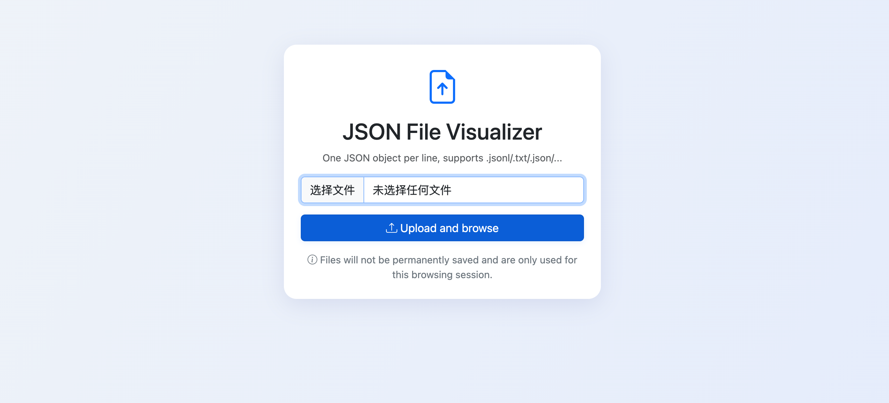

# JsonViewer
Visualize a jsonl file line by line in a formated and elegant way.

# Install
```bash
pip install fastapi uvicorn
```
# Run
```bash
bash run.sh
```
Upload a jsonl file and visualize it line by line!
